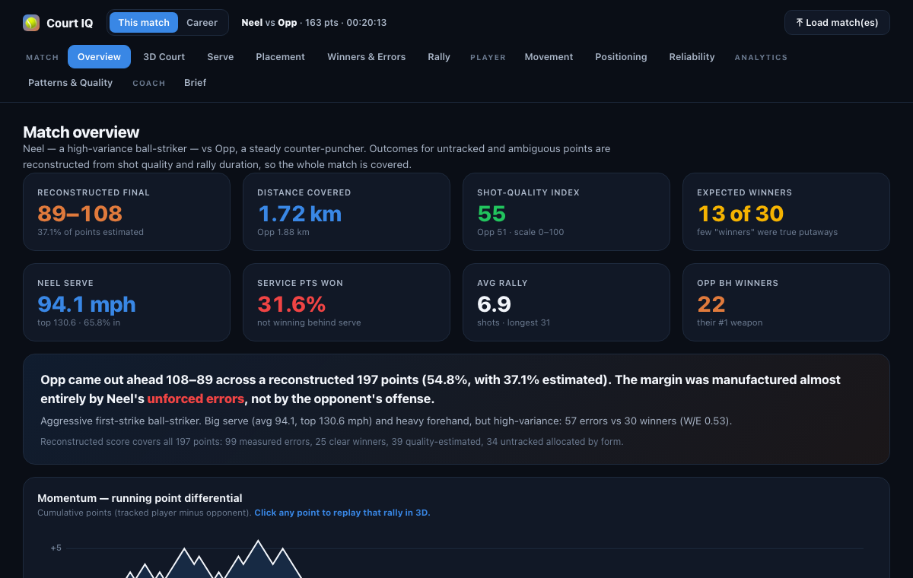
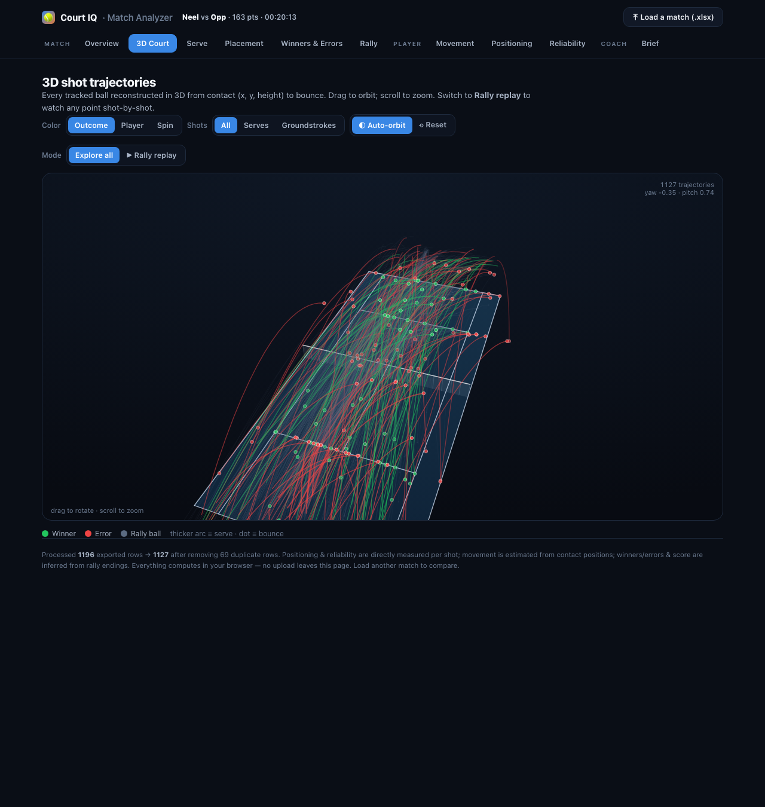
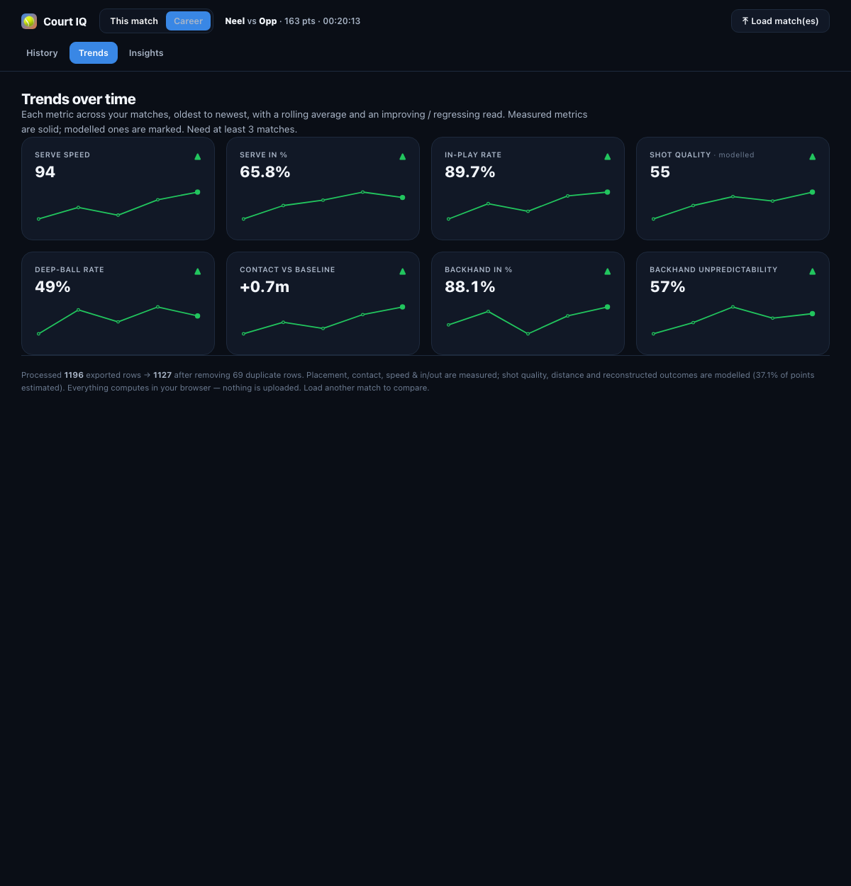
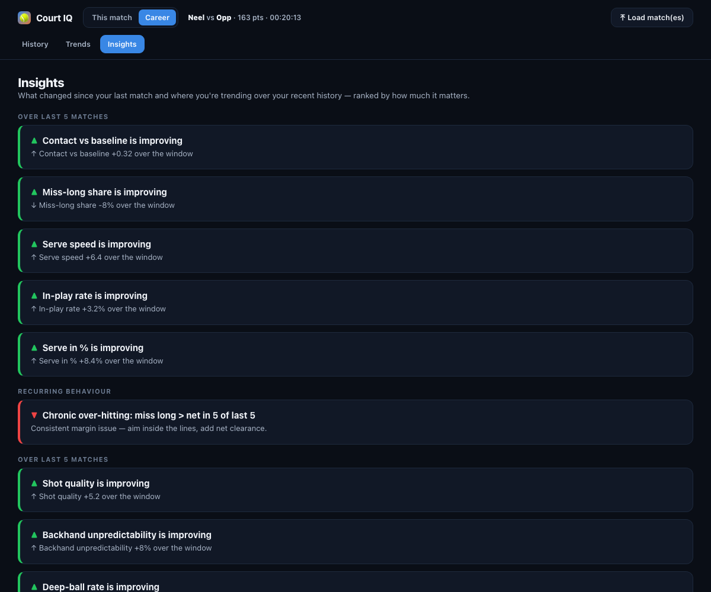

# 🎾 Court IQ

**Self-hosted tennis match & player analytics, built from your [SwingVision](https://swingvision.com) exports.**

Court IQ turns a SwingVision ball-tracking `.xlsx` export into a rich analytics
dashboard — 3D shot trajectories, serve & placement maps, shot-quality scoring,
reconstructed point outcomes — and then tracks how you're improving across many
matches over time.

It's a **single static HTML file**. Everything — parsing the spreadsheet, all
the analytics, storage of your match history — runs in your browser. **No
server, no account, no upload.** Your data never leaves your machine.

<p align="center">
  
  
  
  
</p>

---

## Quick start (self-host)

You need [Node.js](https://nodejs.org) ≥ 18. There are **no dependencies to
install** — the build uses only Node built-ins.

```bash
git clone https://github.com/NSvoltage/court-iq.git
cd court-iq
npm run build      # writes the self-contained dist/index.html
npm run serve      # serves it at http://localhost:5173
```

Or `npm run dev` to build and serve in one step.

`dist/index.html` is fully self-contained — you can also just **open it directly
in a browser** (`file://…`), email it to yourself, or drop it on any static host.

## Getting your data

1. In the SwingVision app, open a recorded match.
2. Export the match — choose the **spreadsheet / `.xlsx`** export (the one with
   per-shot data: a `Shots`, `Rallies` and `Settings` sheet).
3. In Court IQ, click **Load match(es)** (or drag the file onto the page).

A sample match ships with the app so you can explore before loading your own.
Load several files at once to build up history.

## What it does

**Per match (“This match” mode)**

- **Overview** — reconstructed scoreline, distance covered, shot-quality index, expected vs. actual winners, momentum.
- **3D Court** — every shot reconstructed in 3D from contact→bounce, with a shot-by-shot **rally replay**.
- **Serve / Placement / Winners & Errors / Rally** — landing maps, depth, speed histograms, rally-length win rates.
- **Movement · Positioning · Reliability** — estimated distance & work-rate, where you make contact vs. the baseline, and per-shot in/out reliability.
- **Patterns & Quality** — serve+1 plays, forehand/backhand direction tendencies, and a 0–100 shot-quality score.
- **Coach's Brief** — an auto-generated, evidence-backed summary you can export as JSON/CSV.

**Across matches (“Career” mode)**

- **History** — every match you load is saved in your browser; export/import a portable career file to back up or move devices.
- **Trends** — each key metric over time with a rolling average and an *improving / regressing* read.
- **Insights** — what changed since your last match, where you're trending, and recurring behaviours (e.g. chronic over-hitting).

## Measured vs. modelled — an honest tool

SwingVision's tracking isn't perfect, and rally-mode exports don't include the
scoreboard. Court IQ is explicit about what it **measures** vs. what it
**models**:

| Trustworthy (directly measured) | Modelled / reconstructed |
|---|---|
| Shot placement (bounce coordinates) | Who won each point & the score |
| Contact position & speed | Winners vs. errors |
| In / out / net, per shot | Shot-quality index, distance covered |
| Serve speed & landing | First vs. second serve |

Point outcomes are **reconstructed** from shot quality + rally duration to cover
the whole match, and each match reports what fraction of points was estimated.
Modelled metrics are marked as such throughout the UI. See
[`docs/DATA_MODEL.md`](docs/DATA_MODEL.md) for the full methodology.

## How it's built

Court IQ is a build-free-at-runtime static app. `npm run build` concatenates a
few plain-JS modules and the sample match into the HTML template and emits one
file:

```
src/
├── template.html            # UI shell + all views (contains the /*__ASSETS__*/ marker)
├── engine/
│   ├── base.js              # window.SVEngine  — parse, dedupe, measured + first-order metrics
│   ├── augment.js           # window.SVEngine3 — shot quality, outcome reconstruction, patterns
│   └── career.js            # window.Career    — per-match fingerprints, trends, insights, storage
├── vendor/
│   ├── fflate.js            # MIT — CSP-safe unzip (see THIRD_PARTY.md)
│   └── xlsxlite.js          # minimal .xlsx reader (fflate + regex XML parse)
└── data/
    └── sample-match.json    # anonymised demo match (SwingVision sheet dump)

scripts/build.js  →  dist/index.html   (self-contained, ~410 KB)
```

The data pipeline:

```
.xlsx ─► xlsxlite (unzip + parse) ─► SVEngine.build ─► SVEngine3.build ─► M (one model)
                                                                            │
                              Career.fingerprint(M) ─► localStorage history ┘
                                                                            ▼
                                          every view renders from M / the history
```

## Deploy

**GitHub Pages (opinionated, zero-config):** the included workflow
(`.github/workflows/pages.yml`) builds and deploys on every push to `main`.
Enable it once under **Settings → Pages → Source: GitHub Actions**.

**Anywhere else:** `npm run build` and serve the `dist/` folder with any static
host — Netlify, Vercel, Cloudflare Pages, S3, nginx, or `npx serve dist`.

## Develop

```bash
npm run dev     # build + serve, http://localhost:5173
npm test        # engine + career unit tests (node:test)
```

Edit files in `src/`, re-run `npm run build`. There is no bundler or framework —
the engines are plain browser scripts that attach to `window`, and the UI is
hand-rolled SVG/Canvas so the whole thing stays dependency-free and inspectable.

## Roadmap

- Skill radar (spider chart of serve/FH/BH/consistency/movement, current vs. past)
- Dedicated recurring-weakness view and drill recommendations
- Opponent-type & context tagging (surface, event, win/loss)
- Goal setting and progress tracking on any metric
- Optional cross-device sync
- Video-derived layers (pose / continuous movement / ground-truth outcomes)

## Contributing

Issues and PRs welcome — see [`CONTRIBUTING.md`](CONTRIBUTING.md). The metric
system is designed to be extended: add one entry to the `METRICS` table in
`src/engine/career.js` and it automatically flows into fingerprints, trends and
insights.

## Privacy & the sample data

Nothing you load is ever transmitted; parsing and storage are entirely
client-side (`localStorage`). The bundled sample (`src/data/sample-match.json`)
is a real match with the player name anonymised — swap it for your own if you
fork this.

## License

[MIT](LICENSE). Vendored third-party code is documented in
[`THIRD_PARTY.md`](THIRD_PARTY.md). Not affiliated with SwingVision.
