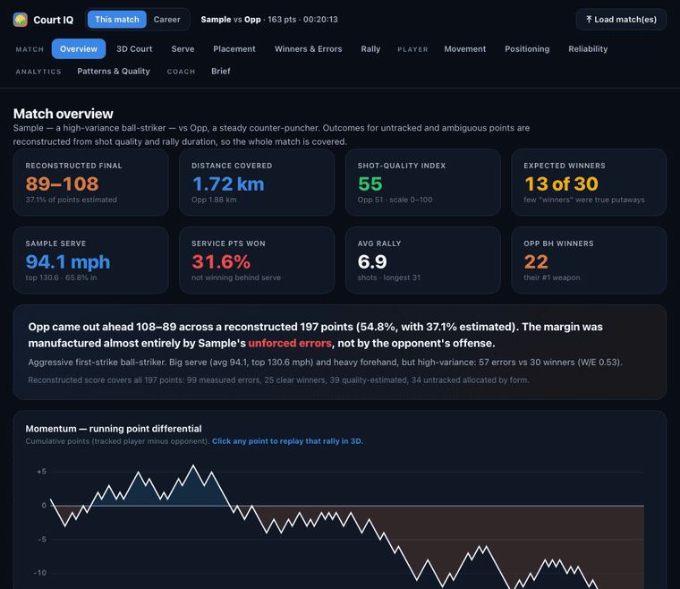
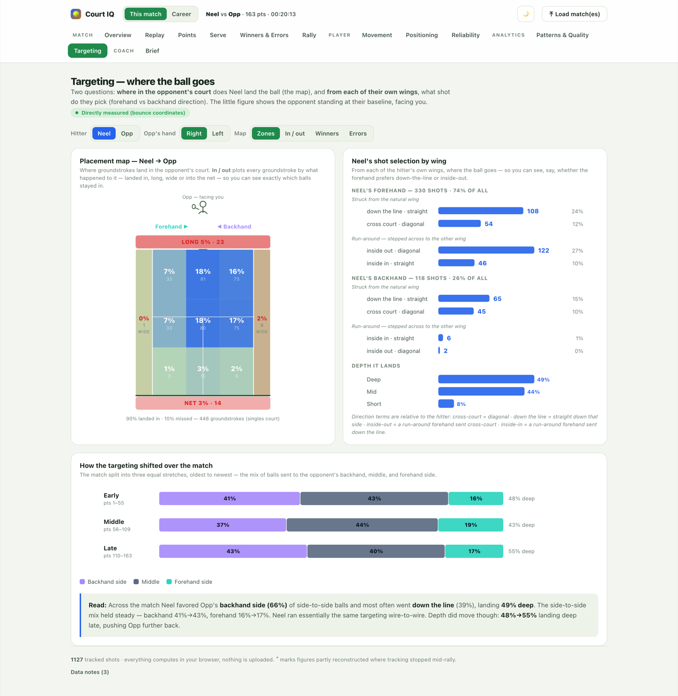
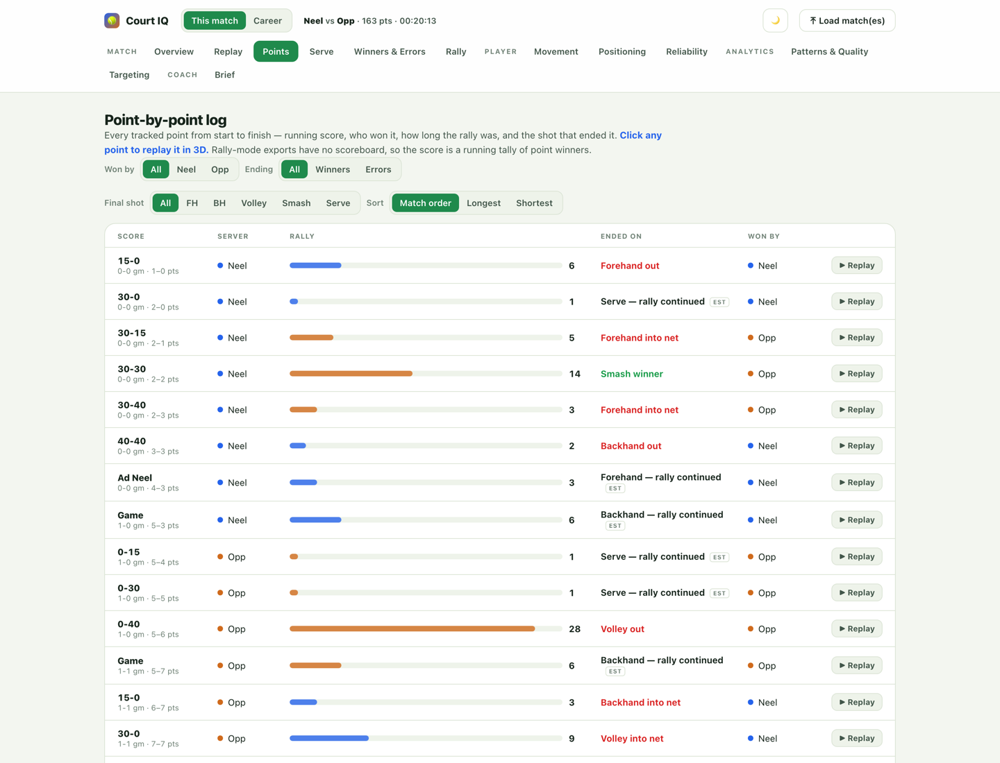
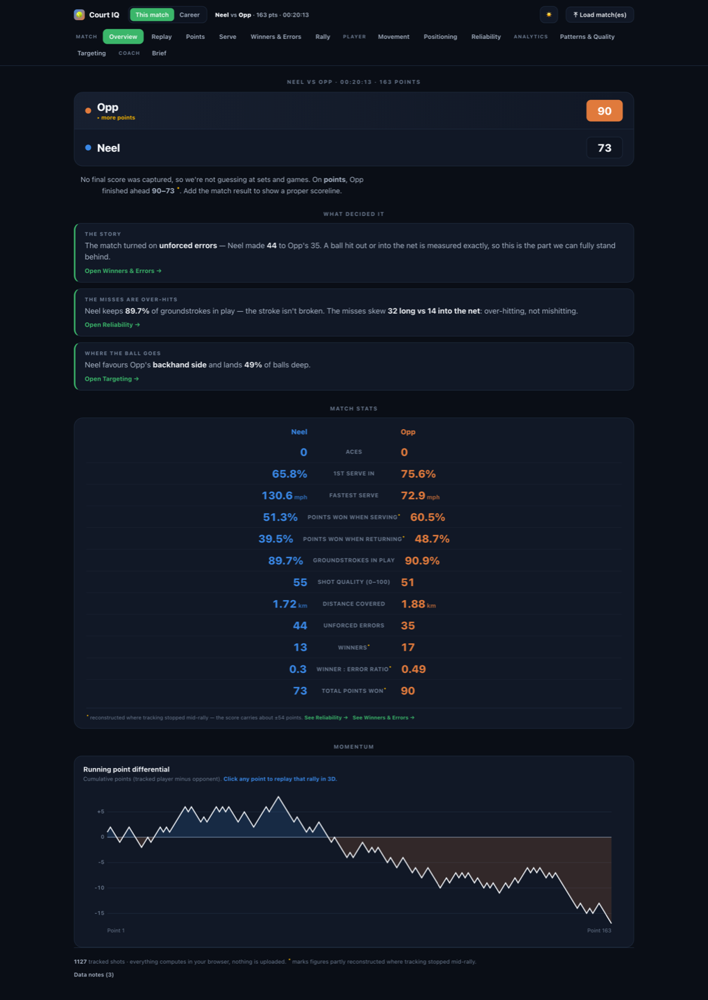

# 🎾 Court IQ

**Self-hosted tennis match & player analytics, built from your [SwingVision](https://swingvision.com) exports.**

Court IQ turns a SwingVision ball-tracking `.xlsx` export into a full analytics
dashboard — placement maps, rally replay, serve and error breakdowns, a coaching
brief — and then tracks how you're improving across many matches.

It's a **single static HTML file**. Parsing the spreadsheet, every analytic, and
your match history all run in your browser. **No server, no account, no upload.**
Your data never leaves your machine.

<p align="center">
  
</p>

---

## Quick start

You need [Node.js](https://nodejs.org) ≥ 18. There is **nothing to install** —
the build uses only Node built-ins and the app has no runtime dependencies.

```bash
git clone https://github.com/NSvoltage/court-iq.git
cd court-iq
npm run dev        # build + serve at http://localhost:5173
```

Or run the steps separately:

```bash
npm run build      # writes the self-contained dist/index.html
npm run serve      # serves it at http://localhost:5173
npm test           # engine + career unit tests
```

`dist/index.html` is fully self-contained (~470 KB). You can open it straight
from disk (`file://…`), email it to yourself, or drop it on any static host.

## Loading your own match

1. In the SwingVision app, open a recorded match.
2. Export it as a **spreadsheet / `.xlsx`** — the export with per-shot data
   (`Settings`, `Shots` and `Rallies` sheets).
3. Click **Load match(es)** in Court IQ, or drag the file onto the page.

Load several files at once to build up history. A sample match is built into the
app so there's something to look at on first open.

**Want to exercise the real path?** [`examples/sample-match.xlsx`](examples/sample-match.xlsx)
is an anonymised SwingVision export — drop it on the page exactly as you would
your own file. It's the same match that's built in, so you can confirm the
`.xlsx` route lands in the same place (there's a test that checks precisely
that).

> **Singles vs. doubles.** The export has no singles/doubles flag, so Court IQ
> assumes **singles** — the doubles alleys are drawn and counted as out. For a
> doubles match the placement maps will read the alleys wrongly.

## What it does

### Per match — “This match”

| View | What's in it |
|---|---|
| **Overview** | The match summary: scoreboard, the three things that decided it, and a broadcast-style statline (serve %, points won serving/returning, in-play %, winners & errors). |
| **Replay** | Every shot reconstructed in 3D from contact → bounce, played back rally by rally, with a point list to skip around. |
| **Points** | Every point — running score, rally length, and how it ended (e.g. *forehand winner*, *backhand out*). Click one to replay it. |
| **Serve** | Landing maps, speed distribution, first-serve rate, and what happens on the serve+1 ball. |
| **Winners & Errors** | Where the points came from, split by stroke and by direction. |
| **Rally** | Win rate by rally length, and how the mix shifts over the match. |
| **Movement · Positioning · Reliability** | Distance and work-rate estimates, where contact is made relative to the baseline, and per-shot in/out rates by stroke. |
| **Patterns & Quality** | Serve+1 plays, forehand/backhand direction tendencies, and a 0–100 shot-quality score. |
| **Targeting** | Where the ball lands in the opponent's court, on a real court projection with in/out zones — plus shot selection by wing (down the line vs. cross court vs. inside-out). |
| **Brief** | An auto-generated, evidence-backed coaching summary, exportable as JSON/CSV. |

### Across matches — “Career”

- **History** — every match you load is saved in your browser; export/import a
  portable career file to back up or move devices.
- **Trends** — each key metric over time with a rolling average and an
  *improving / regressing* read.
- **Insights** — what changed since your last match and recurring behaviours
  (e.g. chronic over-hitting).

<p align="center">
  
  
  
  
</p>

Both a light and a dark theme ship, tuned for reading charts courtside — the
toggle is in the header.

<p align="center">
  
  
</p>

## The honest part: measured vs. modelled

SwingVision's tracking is good but not complete, and rally-mode exports don't
record the scoreboard at all. Court IQ is explicit about which numbers are read
off the tracking and which are inferred — modelled figures carry an asterisk in
the UI.

| Measured — trust directly | Modelled — treat as estimates |
|---|---|
| Bounce and contact coordinates | Who won each point, and the score |
| Ball and serve speed | Winners vs. errors |
| In / out / net, per shot | Shot-quality index, distance covered |
| Placement, depth, direction | First vs. second serve |
| Rally lengths | Momentum, service-points-won |

The export logs **one serve per point**, leaves `Game`/`Set` at zero, and stops
tracking mid-rally on a meaningful share of points. Rather than throw those
points away or quietly guess, Court IQ runs them through an integrity pass.

## The integrity engine

`src/engine/integrity.js` is the single owner of every point-outcome decision,
kept as a separate module so it can be audited and evaluated on its own.

```
CLASSIFY → LEARN prior → IMPUTE → REWRITE → RECOMPUTE → VERIFY
```

- **Declarative rules.** Every outcome comes from an ordered rule table with an
  id and a plain-English reason — including the tennis nuance that *a missed
  first serve doesn't end the point*, so a lone faulted serve is never scored as
  the server losing it.
- **Fully auditable.** Every change is recorded in `M.integrity.repair.audit`
  with the point, the before/after, the rule that fired, why, and a confidence.
- **Actually evaluated.** `SVIntegrity.evaluate()` runs a hold-out stratified by
  server and reports **calibration error** as the primary metric, not just
  per-point accuracy — being right on average matters more than being right on
  any one coin flip.
- **Verified against the rules of tennis.** Impossible states get caught: on the
  sample match both players were winning under half their service points — which
  can't happen, since someone has to be holding — traced to truncation bias and
  corrected from 38.2 / 53.5 % to **51.3 / 60.5 %**, with calibration error
  dropping 17.6 → 3.7 points.
- **Never invents.** Rallies with no shots logged are counted but never scored,
  so the scoreboard always totals the points actually played.

Stat families the export can't support — break points, games and sets — are
reported as unavailable rather than fabricated. See
[`docs/DATA_MODEL.md`](docs/DATA_MODEL.md) for the full methodology.

## How it's built

No framework, no bundler, no runtime dependencies. `npm run build` splices the
engine modules and the sample match into the HTML template at a
`/*__ASSETS__*/` marker and emits one file.

```
src/
├── template.html            # UI shell + every view (contains /*__ASSETS__*/)
├── engine/
│   ├── base.js              # window.SVEngine    — parse, dedupe, measured metrics
│   ├── integrity.js         # window.SVIntegrity — outcome rules, repair, audit, eval
│   ├── augment.js           # window.SVEngine3   — shot quality, targeting, patterns
│   └── career.js            # window.Career      — fingerprints, trends, insights, storage
├── vendor/
│   ├── fflate.js            # MIT — CSP-safe unzip (see THIRD_PARTY.md)
│   └── xlsxlite.js          # minimal .xlsx reader (fflate + regex XML parse)
└── data/
    └── sample-match.json    # anonymised demo match (SwingVision sheet dump)

scripts/build.js  →  dist/index.html
```

The modules load in dependency order — `fflate` → `xlsxlite` → `base` →
`integrity` → `augment` → `career` — and each attaches to `window` (or
`globalThis` under Node), which is why the same files run in the browser and in
the tests.

```
.xlsx ─► xlsxlite ─► SVEngine.build ─► SVIntegrity.process ─► SVEngine3.build ─► M
                                                                                 │
                                       Career.fingerprint(M) ─► localStorage ────┘
                                                                                 ▼
                                             every view renders from M / the history
```

`M` is one plain object and every view is a pure render of it. See
[`docs/ARCHITECTURE.md`](docs/ARCHITECTURE.md) for the module boundaries.

## Deploy

**GitHub Pages:** the included workflow (`.github/workflows/pages.yml`) builds
and deploys on every push to `main`. Enable it once under **Settings → Pages →
Source: GitHub Actions**.

**Anywhere else:** `npm run build`, then serve `dist/` from any static host —
Netlify, Vercel, Cloudflare Pages, S3, nginx, or `npx serve dist`.

## Contributing

Issues and PRs welcome — see [`CONTRIBUTING.md`](CONTRIBUTING.md). The metric
system is table-driven: add one entry to `METRICS` in `src/engine/career.js` and
it flows into fingerprints, trends and insights automatically.

## Roadmap

- Ground-truth scorelines: enter the real result and let the engine reconcile to it
- Dedicated recurring-weakness view with drill recommendations
- Opponent and context tagging (surface, event, win/loss)
- Goal setting and progress tracking on any metric
- Optional accounts and hosted sync, so a career follows you across devices
- Video-derived layers (pose, continuous movement, ground-truth outcomes)

## Privacy & the sample data

Nothing you load is ever transmitted — parsing and storage are entirely
client-side (`localStorage`). The bundled sample
(`src/data/sample-match.json`) is a real match with the players anonymised. Swap
it for your own if you fork this; `.gitignore` already blocks `*.xlsx` so you
can't commit a raw export by accident.

## License

[MIT](LICENSE). Vendored third-party code is documented in
[`THIRD_PARTY.md`](THIRD_PARTY.md). Not affiliated with SwingVision.
